# C# Switch Expressions vs Strategy patterns #
This is testing switch expressions against if, classic switch, and strategy using classes or functions.

## The Experiment ##

Creating a bunch of Shape variants in an Entity-Component-esque approach. One Shape class with a ShapeType Enum to algorithmically "switch" on. All Properties exist but only some are used by each different ShapeType. (C-style union could be applied to compress memory.) There are 3 real variants with 10 artificial variants generated to increase the testing space.

No Inheritance was used, and only the Class-based strategy approach uses an Interface.

## Changes ##

This was run using release mode:  `dotnet run -c Release`
I used an array iteration for all item iteration to keep the algorithms comparible. This iteration will be adding some
overhead compared to alternatives, but this wasn't measured.

I first ran this will  list provisioning and adding inside the loop, this caused variance due to the memory
allocations. I changed to instead sum the areas and return the total area instead to avoid this.

I cached and pinned a shared seed for the data generation to eliminate variance between approaches. I also added some
code from Stack Overflow in an attempt to measure just the right part of the algorithm.
https://stackoverflow.com/questions/969290/exact-time-measurement-for-performance-testing

This is based on a fixed small number of variants (ShapeType enum). The variability of that alorithm may not be
representative enough of a real space. I added some dummy extra ones to bulk the numbers.

## Results ##

item count is the number of items iterated over through the switching logic. There are 14 different types switched on.

```
// * Summary *

BenchmarkDotNet=v0.13.5, OS=Windows 11 (10.0.22621.1702/22H2/2022Update/SunValley2)
AMD Ryzen 9 3900X, 1 CPU, 24 logical and 12 physical cores
.NET SDK=7.0.302
  [Host]     : .NET 7.0.5 (7.0.523.17405), X64 RyuJIT AVX2
  Job-KZXBZW : .NET 7.0.5 (7.0.523.17405), X64 RyuJIT AVX2

Runtime=.NET 7.0  InvocationCount=10  IterationCount=5
LaunchCount=1  RunStrategy=Throughput  UnrollFactor=1
WarmupCount=5

|                                  Method | itemCount |             Mean |           Error |         StdDev |
|---------------------------------------- |---------- |-----------------:|----------------:|---------------:|
|                               FastCheck |        10 |        114.00 ns |        21.09 ns |       5.477 ns |
|                                IfChecks |        10 |        160.00 ns |        74.62 ns |      11.547 ns |
|                                  Switch |        10 |         96.00 ns |        21.09 ns |       5.477 ns |
|                        SwitchExpression |        10 |        116.00 ns |        34.44 ns |       8.944 ns |
|          StaticFunctionSwitchExpression |        10 |        134.00 ns |        58.40 ns |      15.166 ns |
|              StrategyClassWithJumpTable |        10 |        160.00 ns |        54.46 ns |      14.142 ns |
|            StrategyLambdasWithJumpTable |        10 |        166.00 ns |        34.44 ns |       8.944 ns |
|    StrategyStaticFunctionsWithJumpTable |        10 |        192.50 ns |       122.32 ns |      18.930 ns |
|           StrategyClassWithoutJumpTable |        10 |        350.00 ns |       443.24 ns |     115.109 ns |
|         StrategyLambdasWithoutJumpTable |        10 |        257.50 ns |       122.32 ns |      18.930 ns |
| StrategyStaticFunctionsWithoutJumpTable |        10 |        238.00 ns |        63.27 ns |      16.432 ns |
|                               FastCheck |       100 |      1,034.00 ns |       658.90 ns |     171.114 ns |
|                                IfChecks |       100 |      1,668.00 ns |       200.83 ns |      52.154 ns |
|                                  Switch |       100 |        902.00 ns |        95.88 ns |      24.900 ns |
|                        SwitchExpression |       100 |        980.00 ns |       130.58 ns |      33.912 ns |
|          StaticFunctionSwitchExpression |       100 |      1,130.00 ns |        47.16 ns |      12.247 ns |
|              StrategyClassWithJumpTable |       100 |      1,675.00 ns |        64.62 ns |      10.000 ns |
|            StrategyLambdasWithJumpTable |       100 |      1,625.00 ns |       111.92 ns |      17.321 ns |
|    StrategyStaticFunctionsWithJumpTable |       100 |      1,647.50 ns |       161.55 ns |      25.000 ns |
|           StrategyClassWithoutJumpTable |       100 |      2,647.50 ns |       295.54 ns |      45.735 ns |
|         StrategyLambdasWithoutJumpTable |       100 |      2,560.00 ns |       130.58 ns |      33.912 ns |
| StrategyStaticFunctionsWithoutJumpTable |       100 |      2,422.00 ns |        68.88 ns |      17.889 ns |
|                               FastCheck |      1000 |      8,306.00 ns |       169.17 ns |      43.932 ns |
|                                IfChecks |      1000 |     19,182.00 ns |     1,423.02 ns |     369.554 ns |
|                                  Switch |      1000 |     17,270.00 ns |       428.64 ns |      66.332 ns |
|                        SwitchExpression |      1000 |     18,025.00 ns |       291.39 ns |      45.092 ns |
|          StaticFunctionSwitchExpression |      1000 |     19,622.00 ns |     3,891.00 ns |   1,010.480 ns |
|              StrategyClassWithJumpTable |      1000 |     18,280.00 ns |       765.78 ns |     198.872 ns |
|            StrategyLambdasWithJumpTable |      1000 |     20,132.50 ns |       143.29 ns |      22.174 ns |
|    StrategyStaticFunctionsWithJumpTable |      1000 |     21,554.00 ns |     1,420.73 ns |     368.958 ns |
|           StrategyClassWithoutJumpTable |      1000 |     27,664.00 ns |     3,547.88 ns |     921.374 ns |
|         StrategyLambdasWithoutJumpTable |      1000 |     26,574.00 ns |     4,228.93 ns |   1,098.240 ns |
| StrategyStaticFunctionsWithoutJumpTable |      1000 |     24,158.00 ns |       781.31 ns |     202.904 ns |
|                               FastCheck |     10000 |     19,530.00 ns |     1,711.31 ns |     264.827 ns |
|                                IfChecks |     10000 |     95,650.00 ns |     6,964.13 ns |   1,808.563 ns |
|                                  Switch |     10000 |     98,077.50 ns |     6,197.53 ns |     959.075 ns |
|                        SwitchExpression |     10000 |     99,930.00 ns |     8,972.16 ns |   1,388.452 ns |
|          StaticFunctionSwitchExpression |     10000 |    127,108.00 ns |    11,950.66 ns |   3,103.550 ns |
|              StrategyClassWithJumpTable |     10000 |    130,455.00 ns |     9,341.77 ns |   1,445.649 ns |
|            StrategyLambdasWithJumpTable |     10000 |    149,932.00 ns |    30,268.65 ns |   7,860.672 ns |
|    StrategyStaticFunctionsWithJumpTable |     10000 |    149,422.00 ns |     3,622.21 ns |     940.675 ns |
|           StrategyClassWithoutJumpTable |     10000 |    239,135.00 ns |    29,542.18 ns |   4,571.685 ns |
|         StrategyLambdasWithoutJumpTable |     10000 |    233,462.50 ns |     4,066.91 ns |     629.358 ns |
| StrategyStaticFunctionsWithoutJumpTable |     10000 |    231,789.00 ns |    19,613.84 ns |   5,093.651 ns |
|                               FastCheck |    100000 |    126,908.00 ns |     5,088.64 ns |   1,321.503 ns |
|                                IfChecks |    100000 |    855,264.00 ns |    41,438.11 ns |  10,761.347 ns |
|                                  Switch |    100000 |    860,586.00 ns |    31,788.30 ns |   8,255.321 ns |
|                        SwitchExpression |    100000 |    882,220.00 ns |    21,898.30 ns |   3,388.785 ns |
|          StaticFunctionSwitchExpression |    100000 |  1,237,770.00 ns |    56,493.53 ns |  14,671.191 ns |
|              StrategyClassWithJumpTable |    100000 |  1,254,710.00 ns |    40,837.12 ns |  10,605.270 ns |
|            StrategyLambdasWithJumpTable |    100000 |  1,339,550.00 ns |    14,164.68 ns |   2,192.001 ns |
|    StrategyStaticFunctionsWithJumpTable |    100000 |  1,433,430.00 ns |    36,793.20 ns |   9,555.077 ns |
|           StrategyClassWithoutJumpTable |    100000 |  2,365,322.50 ns |   106,547.54 ns |  16,488.350 ns |
|         StrategyLambdasWithoutJumpTable |    100000 |  2,277,926.00 ns |    34,288.28 ns |   8,904.557 ns |
| StrategyStaticFunctionsWithoutJumpTable |    100000 |  2,185,900.00 ns |    65,322.56 ns |  16,964.061 ns |
|                               FastCheck |   1000000 |  3,172,192.50 ns |   823,337.21 ns | 127,412.344 ns |
|                                IfChecks |   1000000 |  8,553,153.00 ns |   400,722.39 ns | 104,066.331 ns |
|                                  Switch |   1000000 |  8,592,271.00 ns |   375,155.82 ns |  97,426.776 ns |
|                        SwitchExpression |   1000000 |  8,565,988.00 ns | 1,003,424.23 ns | 260,586.086 ns |
|          StaticFunctionSwitchExpression |   1000000 |  9,599,897.50 ns |   471,711.34 ns |  72,997.852 ns |
|              StrategyClassWithJumpTable |   1000000 |  8,988,830.00 ns |   283,975.52 ns |  73,747.542 ns |
|            StrategyLambdasWithJumpTable |   1000000 |  9,420,686.00 ns |   300,014.17 ns |  77,912.728 ns |
|    StrategyStaticFunctionsWithJumpTable |   1000000 | 10,225,740.00 ns |   109,420.45 ns |  16,932.935 ns |
|           StrategyClassWithoutJumpTable |   1000000 | 16,305,002.00 ns | 1,203,821.83 ns | 312,628.706 ns |
|         StrategyLambdasWithoutJumpTable |   1000000 | 12,241,712.50 ns |    63,754.66 ns |   9,866.105 ns |
| StrategyStaticFunctionsWithoutJumpTable |   1000000 | 13,361,335.00 ns |   308,519.39 ns |  47,743.717 ns |

```

(Results ordered by fastest at 1M scale.)

```mermaid
gantt
    title Type Switching Performance
    dateFormat  X
    axisFormat %s

    section 10 items
    FastCheck                               : 0, 114
    IfChecks                                : 0, 160
    SwitchExpression                        : 0, 116
    Switch                                  : 0,  96
    StrategyClassWithJumpTable              : 0, 160
    StrategyLambdasWithJumpTable            : 0, 166
    StaticFunctionSwitchExpression          : 0, 134
    StrategyStaticFunctionsWithJumpTable    : 0, 192
    StrategyLambdasWithoutJumpTable         : 0, 257
    StrategyStaticFunctionsWithoutJumpTable : 0, 238
    StrategyClassWithoutJumpTable           : 0, 350
```

```mermaid
gantt
    title Type Switching Performance
    dateFormat  X
    axisFormat %s

    section 1000 items
    FastCheck                               : 0, 8306
    IfChecks                                : 0, 19182
    SwitchExpression                        : 0, 18025
    Switch                                  : 0, 17270
    StrategyClassWithJumpTable              : 0, 18280
    StrategyLambdasWithJumpTable            : 0, 20132
    StaticFunctionSwitchExpression          : 0, 19622
    StrategyStaticFunctionsWithJumpTable    : 0, 21554
    StrategyLambdasWithoutJumpTable         : 0, 26574
    StrategyStaticFunctionsWithoutJumpTable : 0, 24158
    StrategyClassWithoutJumpTable           : 0, 27664
```

```mermaid
gantt
    title Type Switching Performance
    dateFormat  X
    axisFormat %s

    section 1,000,000 items
      FastCheck                               : 0, 3172192
      IfChecks                                : 0, 8553153
      SwitchExpression                        : 0, 8565988
      Switch                                  : 0, 8592271
      StrategyClassWithJumpTable              : 0, 8988830
      StrategyLambdasWithJumpTable            : 0, 9420686
      StaticFunctionSwitchExpression          : 0, 9599897
      StrategyStaticFunctionsWithJumpTable    : 0, 10225740
      StrategyLambdasWithoutJumpTable         : 0, 12241712
      StrategyStaticFunctionsWithoutJumpTable : 0, 13361335
      StrategyClassWithoutJumpTable           : 0, 16305002
```








## Observations ##

Fast Check is super fast! (always look for algorithmic replacements for perf increases instead of micro-optimising language features!)

It was hard to test the jump logic only and some of the algorithmic complexity is likely affecting the results.

There are 4 groupings observed:
* Fast Check
  * Fastest at scale - uncessary or detrimental without that scale.
* language-based switching constructs (if, switch, switch expression)
  * Use any one, all very similar in performance through scale though at small scale switch and switch expression outperform.
* Strategy with Jump table (+ switch expression calling static functions*)
  * Can't beat a raw language construct, but less impactful at scale - complexity affects readability so may be better to throw out entirely rather than introduce jump table?
* Strategy without jump table
  * these are just ripe for performance improving optimisations in all cases.

*"switch expression calling static functions" turns out to be as variable as the jump table versions across the scaling so grouped into that camp - maybe agressive inlining might make a perf difference here?

Strategy patterns come at a performance cost. They also seem to come at a readability cost - though could be due to the simplistic nature of the calculation.
My preference for readability (again, for such simplistic algorithms) is the switch expression. This also seems to be the fastest (comparing apples to apples), comparible to raw `if` checks.

the comparison between `switch`, `if` and switch expression varies at different scales and the margin of error isn't great for comparing definitively.

## Conclusion ##

I conclude that using Switch Expressions is a good default choice - especially for readability - before measuring anything. But choosing if and switch are also acceptible default perf choices.

You have to measure in your own situation as there are many factors that affect how different switching performs - don't just blindly take these results as definitive.

Using the strategy pattern has to really improve Developer/Development Maintainance and/or readability to be worth considering, based on the results presented here.


This exercise was Inspired by ["Clean" Code, Horrible Performance](https://www.computerenhance.com/p/clean-code-horrible-performance)

Another Blog doing similar analysis and conclusions: https://davidkroell.com/blog/2022/switch-is-faster-than-if/